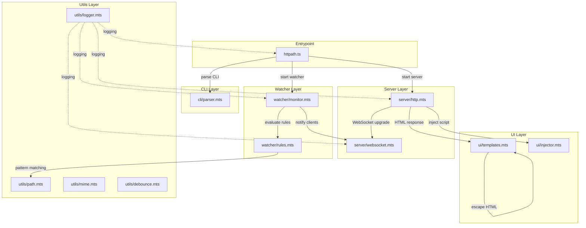
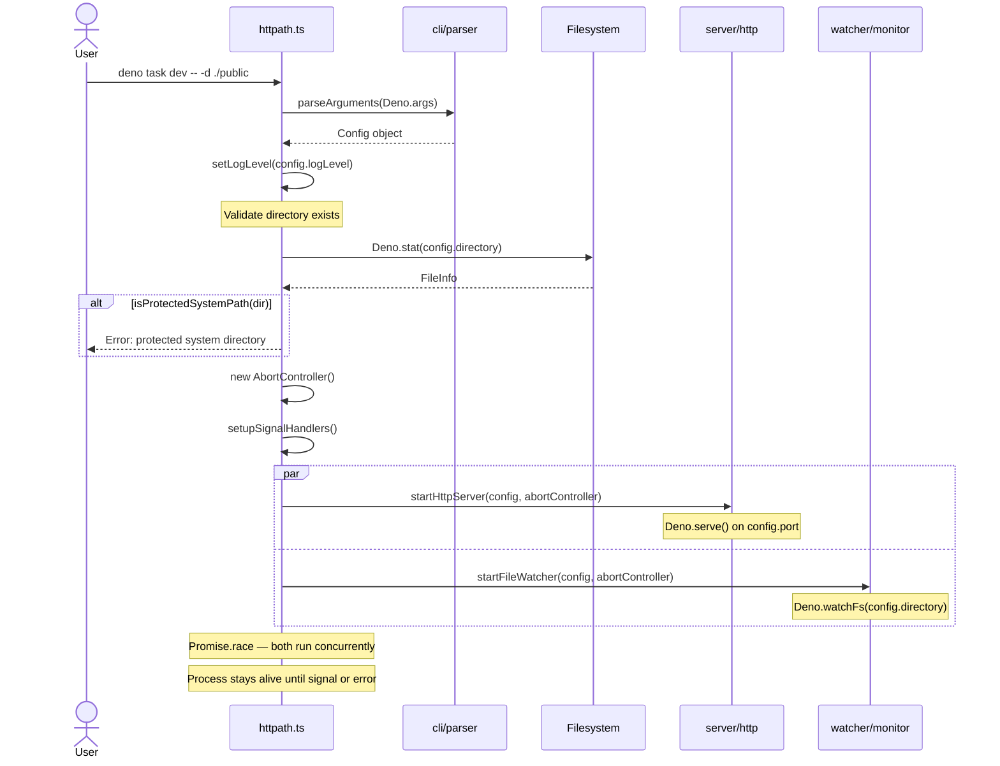
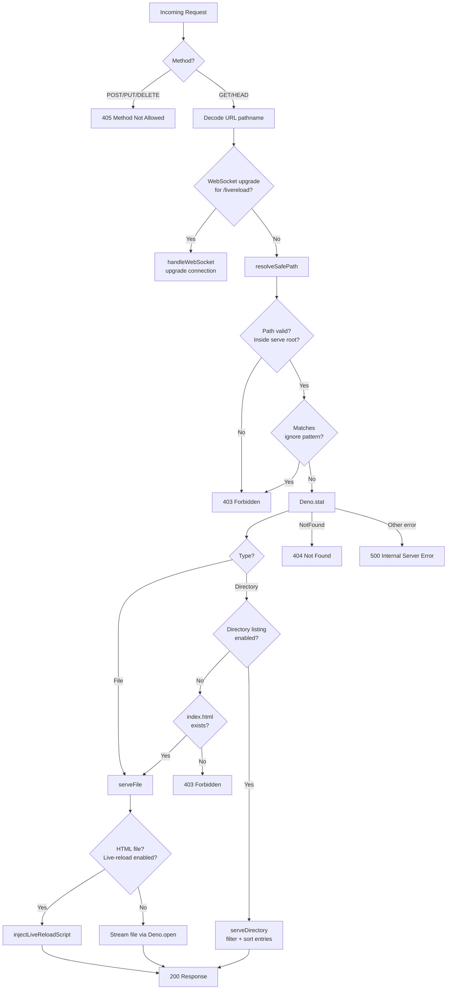
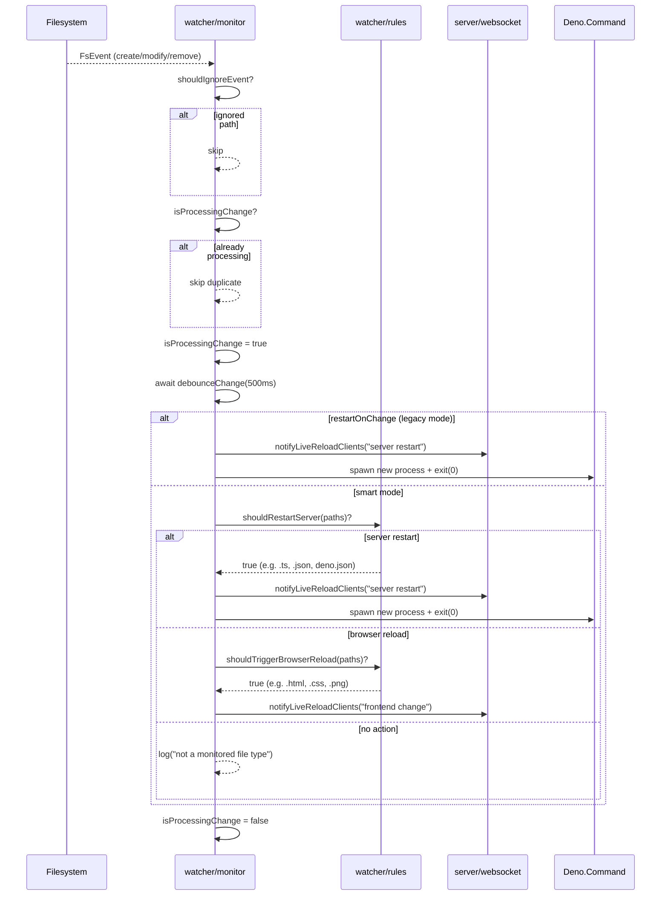
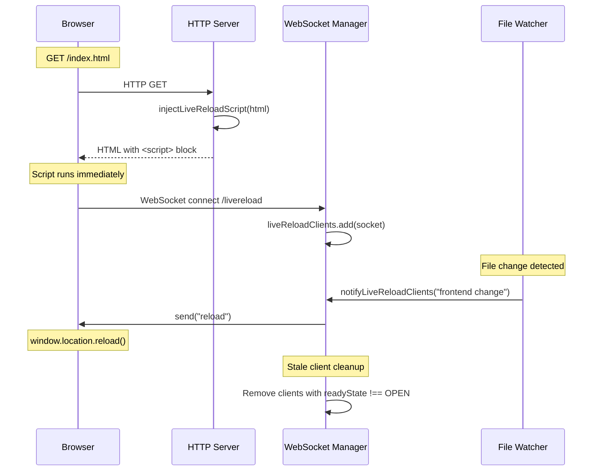
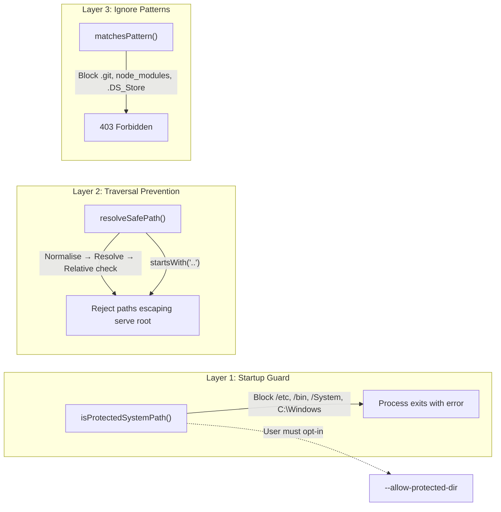
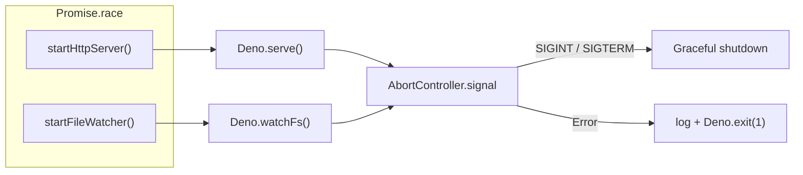

# Architecture

> **httpath** is a lightweight, zero-dependency static file server for Deno with
> live-reload, directory listing, and smart file-watching. This document describes
> the internal architecture, key flows, and the rationale behind every design
> decision.

---

## High-Level Overview

httpath follows a **layered architecture** with five distinct domains. Each layer
has a single responsibility and communicates through well-defined interfaces
(`Config`, function parameters).



---

## Module Map

| Layer | Module | Responsibility | Key Exports |
|-------|--------|----------------|-------------|
| **Entrypoint** | `httpath.ts` | Orchestration, signal handling, validation | `main()` |
| **CLI** | `cli/parser.mts` | Argument parsing, defaults, validation | `parseArguments()`, `DEFAULT_CONFIG` |
| **Server** | `server/http.mts` | HTTP request routing, file/directory serving | `createRequestHandler()`, `startHttpServer()` |
| **Server** | `server/websocket.mts` | WebSocket live-reload client management | `handleWebSocket()`, `notifyLiveReloadClients()` |
| **Watcher** | `watcher/monitor.mts` | File system watching, debounce, restart/reload dispatch | `startFileWatcher()`, `reloadServer()` |
| **Watcher** | `watcher/rules.mts` | Pure decision functions for restart vs. reload | `shouldIgnoreEvent()`, `shouldRestartServer()`, `shouldTriggerBrowserReload()` |
| **UI** | `ui/templates.mts` | HTML/CSS generation for directory listings | `generateDirectoryListingHTML()`, `escapeHtml()` |
| **UI** | `ui/injector.mts` | Live-reload script generation and injection | `getLiveReloadScript()`, `injectLiveReloadScript()` |
| **Utils** | `utils/logger.mts` | Leveled console logging | `log()`, `setLogLevel()` |
| **Utils** | `utils/path.mts` | Path security, pattern matching | `resolveSafePath()`, `matchesPattern()`, `isProtectedSystemPath()` |
| **Utils** | `utils/mime.mts` | MIME type detection via `@std/media-types` | `getMimeType()` |
| **Utils** | `utils/debounce.mts` | Debounce factory and singleton | `createDebouncer()`, `debounce()` |
| **Shared** | `types.mts` | Shared TypeScript interfaces and constants | `Config`, `FileEntry`, `LIVE_RELOAD_ENDPOINT` |

---

## Startup Flow

When the user runs `httpath`, the following sequence executes:



---

## HTTP Request Handling

Every incoming request follows this decision tree:



---

## File Watcher — Smart Mode

The watcher operates in two modes. **Smart mode** (default) analyses file
extensions to decide the action. **Legacy mode** (`-r` / `--restart-on-change`)
always restarts the server.



### Decision Matrix

| File Extension | `shouldRestartServer` | `shouldTriggerBrowserReload` | Action |
|----------------|:---------------------:|:---------------------------:|--------|
| `.ts`, `.js`, `.mjs` | ✅ | ✅ | **Server restart** (takes priority) |
| `.json` | ✅ | ✅ | **Server restart** |
| `.toml`, `.yaml`, `.yml` | ✅ | ❌ | **Server restart** |
| `deno.json`, `deno.lock`, `package.json` | ✅ | ❌ | **Server restart** |
| `.html`, `.css` | ❌ | ✅ | **Browser reload** |
| `.scss`, `.sass`, `.less` | ❌ | ✅ | **Browser reload** |
| `.vue`, `.svelte`, `.tsx`, `.jsx` | ❌ | ✅ | **Browser reload** |
| `.md` | ❌ | ✅ | **Browser reload** |
| `.png`, `.jpg`, `.svg`, `.gif`, `.webp`, `.ico` | ❌ | ✅ | **Browser reload** |
| `.woff`, `.woff2`, `.ttf`, `.eot` | ❌ | ✅ | **Browser reload** |
| `.log`, `.txt`, other | ❌ | ❌ | **No action** |

---

## Live Reload Flow

When the server injects a live-reload script into an HTML page, the browser
establishes a WebSocket connection. File changes trigger notifications:



---

## Security Model

httpath has **three layers** of path security:



### Layer Details

| Layer | Where | What It Protects Against | How |
|-------|-------|--------------------------|-----|
| **Startup Guard** | `httpath.ts:main()` | Accidentally serving `/etc`, `C:\Windows`, etc. | Prefix-match against per-OS blocklist. Hard error unless `--allow-protected-dir`. |
| **Traversal Prevention** | `utils/path.mts:resolveSafePath()` | `../../etc/passwd` attacks | Resolve + normalize + check `relative()` starts with `..`. |
| **Ignore Patterns** | `server/http.mts:isIgnoredSafePath()` | Serving `.git/`, `node_modules/`, `.DS_Store` | Substring/suffix match against configurable patterns. |

---

## Concurrency Model

httpath runs two concurrent async tasks via `Promise.race`:



- Both tasks share an `AbortController` for coordinated shutdown.
- `Promise.race` ensures the process exits if **either** task throws.
- Signal handlers (`SIGINT`, `SIGTERM`) abort the controller and exit cleanly.
- On Windows, `SIGTERM` is unsupported — the error is caught silently.

---

## Design Decisions

### 1. Factory Pattern for Request Handler and Debouncer

**Decision:** `createRequestHandler(config)` and `createDebouncer()` return
closures rather than using classes.

**Rationale:**
- Closures capture `config` / internal state via lexical scope — no `this`
  binding issues, no class instantiation ceremony.
- The returned function is a plain `async (Request) => Response`, compatible
  directly with `Deno.serve({ handler })`.
- Each debouncer instance has isolated state (`pendingResolvers`, timeout handle),
  preventing cross-contamination between watcher and potential future consumers.

### 2. Separate Watcher Rules from Watcher Engine

**Decision:** `watcher/rules.mts` exports pure functions (`shouldRestartServer`,
`shouldTriggerBrowserReload`). `watcher/monitor.mts` contains the imperative
watcher loop.

**Rationale:**
- **Testability:** Rules are pure functions — trivially testable without
  filesystem mocking.
- **Single Responsibility:** `monitor.mts` handles debounce, concurrency guards,
  and process lifecycle. `rules.mts` handles file-extension classification.
- Rules can be swapped or extended without touching the watcher loop.

### 3. Hoisted Regex Constants

**Decision:** `SERVER_RESTART_PATTERNS` and `BROWSER_RELOAD_PATTERNS` are
module-level constants, not created inside functions.

**Rationale:**
- File-watch events are **hot** — regex arrays were being reconstructed on every
  call. Hoisting eliminates repeated allocation.
- Module-level constants are also easier to test and document.

### 4. Two-Level Debounce Strategy

**Decision:** A 500ms debounce on file events, plus an `isProcessingChange`
guard that resets immediately after processing (not via a fixed timer).

**Rationale:**
- File editors often save multiple files atomically (e.g., format-on-save
  touching 3 files). The 500ms debounce batches these into one event.
- The `isProcessingChange` flag prevents duplicate events from entering the
  critical section while debounce + restart/reload is still in-flight.
- Previous implementation used `setTimeout(1000)` in `finally` — this caused a
  race condition where the reset fired before processing completed.

### 5. Immutable Client Set (Encapsulated)

**Decision:** `liveReloadClients` is a private `Set<WebSocket>`, exposed only
through `handleWebSocket()` and `notifyLiveReloadClients()`.

**Rationale:**
- Exporting a mutable `Set` would let any consumer `.add()`, `.delete()`, or
  `.clear()` it, breaking the WebSocket lifecycle contract.
- `getLiveReloadClientCount()` provides read-only access for diagnostics.

### 6. Smart vs. Legacy Mode

**Decision:** Default is **smart mode** (restart only for server-side files,
browser reload for frontend files). `--restart-on-change` activates legacy mode.

**Rationale:**
- Most developers edit HTML/CSS/JS during development — restarting the server
  for these changes is unnecessary and slow.
- Config files (`.json`, `.yaml`, `deno.json`) require a server restart because
  they affect runtime behavior.
- Legacy mode exists for edge cases where users want the old behavior.

### 7. HTML Injection Strategy

**Decision:** Live-reload script is injected **server-side** into HTML responses,
not loaded as an external file.

**Rationale:**
- No additional HTTP request for the script — zero latency.
- Works with any HTML file, even those without a `<head>` or explicit script
  includes.
- Injection order: `</body>` → `</html>` → append at end. This ensures the
  script runs after the DOM is ready.

### 8. Cross-Platform Protected Paths

**Decision:** Blocklist of system directories, selected at runtime via
`Deno.build.os`. Case-insensitive on Windows.

**Rationale:**
- Path-based (no filesystem access required) — fast and deterministic.
- Prefix-match with separator ensures `/etc` blocks `/etc/nginx` but NOT
  `/etc-custom`.
- `/var`, `/opt`, `/usr`, `/tmp` are intentionally **not** blocked — they have
  legitimate development use cases.
- `--allow-protected-dir` provides an explicit escape hatch.

### 9. Zero External Dependencies

**Decision:** Only `@std/*` standard library modules (cli, path, media-types,
assert, testing/mock).

**Rationale:**
- Eliminates supply-chain risk — no `node_modules`, no transitive
  vulnerabilities.
- Smaller binary footprint when compiled.
- The Deno standard library covers all required functionality.

### 10. Barrel Exports

**Decision:** Each `src/` subdirectory has an `index.ts` that re-exports all
public symbols from its modules.

**Rationale:**
- Clean import paths: `import { log, getMimeType } from "../utils/index.ts"`
  instead of importing from individual files.
- Single point of control for what each layer exposes externally.
- Changing internal file structure doesn't break consumers.

---

## File Tree Reference

```text
httpath/
├── deno.json                    # Tasks, imports, metadata
├── deno.lock                    # Pinned dependency versions
├── httpath.ts                   # Entry point (shebang + main)
├── src/
│   ├── types.mts                # Config, FileEntry, LIVE_RELOAD_ENDPOINT
│   ├── cli/
│   │   ├── index.ts             # Barrel export
│   │   └── parser.mts           # CLI argument parsing + defaults
│   ├── server/
│   │   ├── index.ts             # Barrel export
│   │   ├── http.mts             # Request handler + Deno.serve
│   │   └── websocket.mts        # WebSocket client management
│   ├── watcher/
│   │   ├── index.ts             # Barrel export
│   │   ├── monitor.mts          # File watcher + debounce + restart
│   │   └── rules.mts            # Pure decision functions
│   ├── ui/
│   │   ├── index.ts             # Barrel export
│   │   ├── templates.mts        # HTML/CSS directory listing
│   │   └── injector.mts         # Live-reload script injection
│   └── utils/
│       ├── index.ts             # Barrel export
│       ├── logger.mts           # Leveled logging
│       ├── path.mts             # Path security + pattern matching
│       ├── mime.mts             # MIME type detection
│       └── debounce.mts         # Debounce factory
├── tests/
│   ├── debounce.test.ts
│   ├── http.test.ts
│   ├── injector.test.ts
│   ├── logger.test.ts
│   ├── mime.test.ts
│   ├── parser.test.ts
│   ├── path.test.ts
│   ├── rules.test.ts
│   └── templates.test.ts
└── docs/
    ├── architecture.md          # This file
    └── workflow.md              # Development workflow
```
