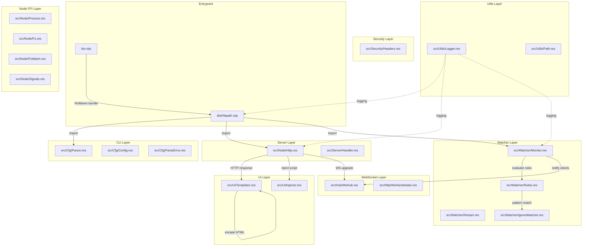
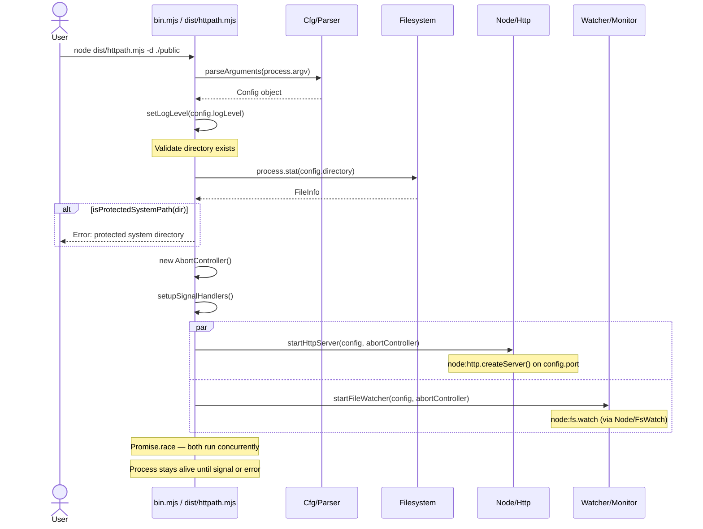
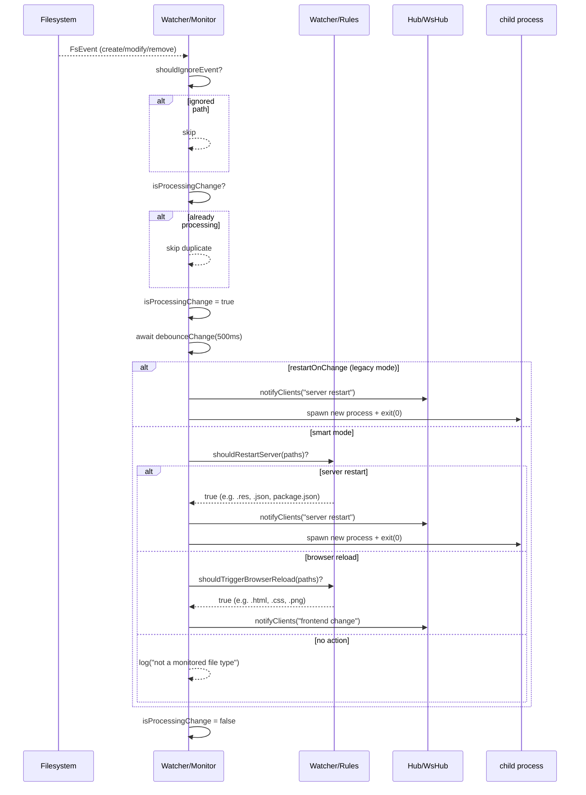
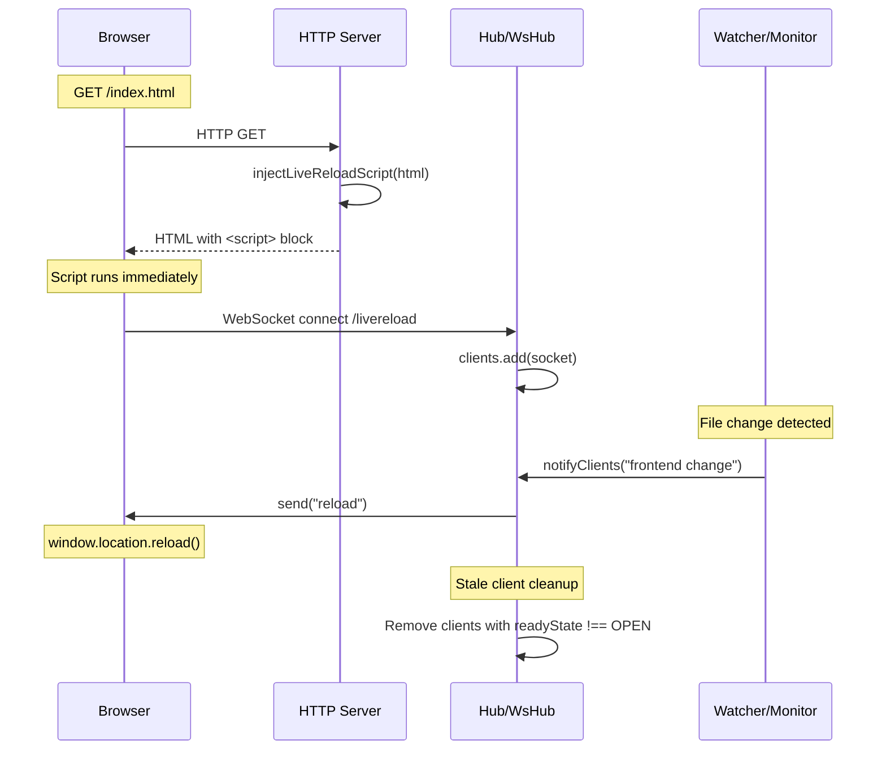
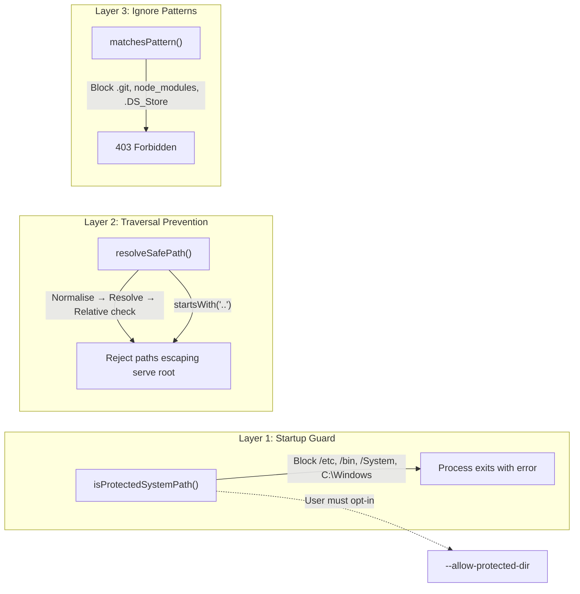
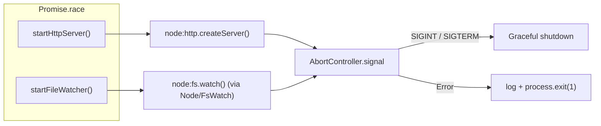

# Architecture

> **httpath** is a lightweight static file server for Node.js, written in
> ReScript and compiled to a single ESM bundle via Rolldown. This document
> describes the internal architecture, key flows, and the rationale behind every
> design decision.

---

## High-Level Overview

httpath follows a **layered architecture** with five distinct domains. Each
layer has a single responsibility and communicates through well-defined
interfaces (`Config`, function parameters).



---

## Module Map

| Layer           | Module                                                                        | Responsibility                                          | Key Exports                                                                 |
| --------------- | ----------------------------------------------------------------------------- | ------------------------------------------------------- | --------------------------------------------------------------------------- |
| **Entrypoint**  | `bin.mjs` (source) → `dist/httpath.mjs` (Rolldown bundle)                    | CLI entry; imports and runs Httpath                    | `main()`                                                                    |
| **Lifecycle**   | `src/Httpath.res`                                                             | Parse argv → HTTP server + Monitor + signals           | `main()`, startHttpServer(), startFileWatcher()                            |
| **CLI**         | `src/Cfg/Parser.res`                                                          | Argument parsing, defaults, validation                  | `parseArguments()`, `DEFAULT_CONFIG`                                        |
| **CLI**         | `src/Cfg/Config.res`                                                          | Config type definitions                                 | `Config`, config fields                                                     |
| **CLI**         | `src/Cfg/ParseError.res`                                                      | CLI error variants                                      | `ParseError`                                                                |
| **HTTP server** | `src/Node/Http.res`                                                           | Node `node:http` server + upgrade handling             | `createServer()`, `upgradeHandler()`                                        |
| **HTTP server** | `src/Server/Handler.res`                                                      | Request routing, file/directory serving                | `createRequestHandler()`                                                    |
| **WebSocket**   | `src/Hub/WsHub.res`                                                           | Live-reload client registry + notifications             | `addClient()`, `notifyClients()`                                            |
| **WebSocket**   | `src/Http/WsHandshake.res`                                                    | RFC 6455 WebSocket handshake                           | `isWsUpgrade()`, `performHandshake()`                                       |
| **Watcher**     | `src/Watcher/Monitor.res`                                                     | File watching, debounce, restart/reload dispatch       | `startFileWatcher()`                                                        |
| **Watcher**     | `src/Watcher/Rules.res`                                                       | Pure decision functions for restart vs. reload          | `shouldIgnoreEvent()`, `shouldRestartServer()`, `shouldTriggerBrowserReload()` |
| **Watcher**     | `src/Watcher/Restart.res`                                                      | Process spawn for server restart                       | `restartServer()`                                                           |
| **Watcher**     | `src/Watcher/IgnoreMatcher.res`                                                | Ignore pattern matching                                 | `shouldIgnore()`                                                            |
| **UI**          | `src/Ui/Templates.res`                                                         | HTML/CSS generation for directory listings              | `generateDirectoryListingHTML()`, `escapeHtml()`                            |
| **UI**          | `src/Ui/Injector.res`                                                          | Live-reload script generation and injection             | `getLiveReloadScript()`, `injectLiveReloadScript()`                         |
| **Security**    | `src/Security/Headers.res`                                                    | Security headers                                        | `setSecurityHeaders()`                                                       |
| **Utils**       | `src/Utils/Logger.res`                                                         | Leveled console logging                                 | `log()`, `setLogLevel()`                                                    |
| **Utils**       | `src/Utils/Path.res`                                                           | Path security, pattern matching                         | `resolveSafePath()`, `matchesPattern()`, `isProtectedSystemPath()`          |
| **Types**       | `src/Types.res`                                                                | Shared ReScript types and variants                      | `Config`, `FileEntry`, `LIVE_RELOAD_ENDPOINT`                               |
| **Node FFI**    | `src/Node/Process.res`, `Buffer.res`, `Crypto.res`, `Events.res`, `Fs.res`, `FsWatch.res`, `Node_Path.res`, `Signals.res`, `Timers.res`, `AbortController.res`, `Process_spawn.res` | Typed externals for Node built-ins | Direct bindings to `node:*` built-in modules               |

---

## Startup Flow

When the user runs `httpath`, the following sequence executes:



---

## HTTP Request Handling

Every incoming request follows this decision tree:


---

## File Watcher — Smart Mode

The watcher operates in two modes. **Smart mode** (default) analyses file
extensions to decide the action. **Legacy mode** (`-r` / `--restart-on-change`)
always restarts the server.



### Decision Matrix

| File Extension                                  | `shouldRestartServer` | `shouldTriggerBrowserReload` | Action                              |
| ----------------------------------------------- | :-------------------: | :--------------------------: | ----------------------------------- |
| `.res`, `.js`, `.mjs`                           |          ✅           |              ✅              | **Server restart** (takes priority) |
| `.json`                                         |          ✅           |              ✅              | **Server restart**                  |
| `.toml`, `.yaml`, `.yml`                        |          ✅           |              ❌              | **Server restart**                  |
| `package.json`, `rescript.json`, `rolldown.config.mjs` |     ✅        |              ❌              | **Server restart**                  |
| `.html`, `.css`                                 |          ❌           |              ✅              | **Browser reload**                  |
| `.scss`, `.sass`, `.less`                       |          ❌           |              ✅              | **Browser reload**                  |
| `.vue`, `.svelte`, `.tsx`, `.jsx`               |          ❌           |              ✅              | **Browser reload**                  |
| `.md`                                           |          ❌           |              ✅              | **Browser reload**                  |
| `.png`, `.jpg`, `.svg`, `.gif`, `.webp`, `.ico` |          ❌           |              ✅              | **Browser reload**                  |
| `.woff`, `.woff2`, `.ttf`, `.eot`               |          ❌           |              ✅              | **Browser reload**                  |
| `.log`, `.txt`, other                           |          ❌           |              ❌              | **No action**                       |

---

## Live Reload Flow

When the server injects a live-reload script into an HTML page, the browser
establishes a WebSocket connection. File changes trigger notifications:



---

## Security Model

httpath has **three layers** of security:



### Layer Details

| Layer                    | Where                                 | What It Protects Against                        | How                                                                               |
| ------------------------ | ------------------------------------- | ----------------------------------------------- | --------------------------------------------------------------------------------- |
| **Startup Guard**        | `Httpath.res:main()`                  | Accidentally serving `/etc`, `C:\Windows`, etc. | Prefix-match against per-OS blocklist. Hard error unless `--allow-protected-dir`. |
| **Traversal Prevention** | `Utils/Path.res:resolveSafePath()`   | `../../etc/passwd` attacks                      | Resolve + normalize + check `relative()` starts with `..`.                        |
| **Ignore Patterns**      | `Server/Handler.res:isIgnoredPath()` | Serving `.git/`, `node_modules/`, `.DS_Store`   | Substring/suffix match against configurable patterns.                             |

---

## Concurrency Model

httpath runs two concurrent async tasks via `Promise.race`:



- Both tasks share an `AbortController` for coordinated shutdown.
- `Promise.race` ensures the process exits if **either** task throws.
- Signal handlers (`SIGINT`, `SIGTERM`) abort the controller and exit cleanly.
- On Windows, `SIGTERM` is unsupported — the error is caught silently.

---

## Design Decisions

### 1. Factory Pattern for Request Handler and Debouncer

**Decision:** `createRequestHandler(config)` and `createDebouncer()` return
closures rather than using classes.

**Rationale:**

- Closures capture `config` / internal state via lexical scope — no `this`
  binding issues, no class instantiation ceremony.
- The returned function is a plain `async (IncomingMessage, ServerResponse) => void`,
  compatible directly with `node:http.createServer()`.
- Each debouncer instance has isolated state (`pendingResolvers`, timeout
  handle), preventing cross-contamination between watcher and potential future
  consumers.

### 2. Separate Watcher Rules from Watcher Engine

**Decision:** `Watcher/Rules.res` exports pure functions (`shouldRestartServer`,
`shouldTriggerBrowserReload`). `Watcher/Monitor.res` contains the imperative
watcher loop.

**Rationale:**

- **Testability:** Rules are pure functions — trivially testable without
  filesystem mocking.
- **Single Responsibility:** `Monitor.res` handles debounce, concurrency guards,
  and process lifecycle. `Rules.res` handles file-extension classification.
- Rules can be swapped or extended without touching the watcher loop.

### 3. Hoisted Regex Constants

**Decision:** `SERVER_RESTART_PATTERNS` and `BROWSER_RELOAD_PATTERNS` are
module-level constants, not created inside functions.

**Rationale:**

- File-watch events are **hot** — regex arrays were being reconstructed on every
  call. Hoisting eliminates repeated allocation.
- Module-level constants are also easier to test and document.

### 4. Two-Level Debounce Strategy

**Decision:** A 500ms debounce on file events, plus an `isProcessingChange`
guard that resets immediately after processing (not via a fixed timer).

**Rationale:**

- File editors often save multiple files atomically (e.g., format-on-save
  touching 3 files). The 500ms debounce batches these into one event.
- The `isProcessingChange` flag prevents duplicate events from entering the
  critical section while debounce + restart/reload is still in-flight.
- Previous implementation used `setTimeout(1000)` in `finally` — this caused a
  race condition where the reset fired before processing completed.

### 5. Immutable Client Set (Encapsulated)

**Decision:** `liveReloadClients` is a private `Set<WebSocket>`, exposed only
through `handleWebSocket()` and `notifyClients()`.

**Rationale:**

- Exporting a mutable `Set` would let any consumer `.add()`, `.delete()`, or
  `.clear()` it, breaking the WebSocket lifecycle contract.
- `getClientCount()` provides read-only access for diagnostics.

### 6. Smart vs. Legacy Mode

**Decision:** Default is **smart mode** (restart only for server-side files,
browser reload for frontend files). `--restart-on-change` activates legacy mode.

**Rationale:**

- Most developers edit HTML/CSS/JS during development — restarting the server
  for these changes is unnecessary and slow.
- Config files (`.json`, `.yaml`, `package.json`) require a server restart because
  they affect runtime behavior.
- Legacy mode exists for edge cases where users want the old behavior.

### 7. HTML Injection Strategy

**Decision:** Live-reload script is injected **server-side** into HTML
responses, not loaded as an external file.

**Rationale:**

- No additional HTTP request for the script — zero latency.
- Works with any HTML file, even those without a `<head>` or explicit script
  includes.
- Injection order: `</body>` → `</html>` → append at end. This ensures the
  script runs after the DOM is ready.

### 8. Cross-Platform Protected Paths

**Decision:** Blocklist of system directories, selected at runtime via
`process.platform`. Case-insensitive on Windows.

**Rationale:**

- Path-based (no filesystem access required) — fast and deterministic.
- Prefix-match with separator ensures `/etc` blocks `/etc/nginx` but NOT
  `/etc-custom`.
- `/var`, `/opt`, `/usr`, `/tmp` are intentionally **not** blocked — they have
  legitimate development use cases.
- `--allow-protected-dir` provides an explicit escape hatch.

### 9. Zero External Runtime Dependencies

**Decision:** Only Node.js built-in modules (`node:http`, `node:fs`, `node:path`,
etc.) at runtime. Build tools (`rescript`, `rolldown`) are dev dependencies.

**Rationale:**

- Eliminates supply-chain risk — no `node_modules`, no transitive
  vulnerabilities beyond Node itself.
- Smaller bundle footprint.
- Node's built-in modules cover all required functionality.

### 10. In-Source ReScript Compilation

**Decision:** ReScript source files (`.res`) compile to `.res.mjs` in the same
`src/` directory, alongside source. Rolldown bundles from `bin.mjs`.

**Rationale:**

- No separate `lib/` or `build/` output directory to manage.
- `rescript.json` configures `suffix` as `.res.mjs` so compiled output is
  colocated with source.
- Rolldown takes `bin.mjs` as input and bundles all imports (including
  `src/**/*.res.mjs`) into `dist/httpath.mjs`.

### 11. AbortController for Coordinated Shutdown

**Decision:** A single `AbortController` is shared between the HTTP server and
file watcher. Both tasks monitor `signal` and clean up on abort.

**Rationale:**

- Standard web API — consistent with `fetch`, `EventTarget`, etc.
- No custom event bus or shared state object needed.
- SIGINT/SIGTERM handlers call `abort()` on the controller, and both tasks
  react independently.
- Works correctly on Node 18+.

---

## File Tree Reference

```text
httpath/
├── bin.mjs                     # Rolldown input — CLI entry point
├── dist/
│   └── httpath.mjs             # Published bundle (npm package entry)
├── package.json                # Dependencies, scripts, bin entry
├── rescript.json               # ReScript compiler config (suffix: .res.mjs)
├── rolldown.config.mjs         # Rolldown bundler config
├── src/
│   ├── Httpath.res             # Main lifecycle (main, startServer, startWatcher)
│   ├── Types.res               # Shared types: Config, FileEntry, LIVE_RELOAD_ENDPOINT
│   ├── Cfg/
│   │   ├── Config.res          # Config type
│   │   ├── Parser.res          # CLI argument parsing
│   │   └── ParseError.res      # CLI error variants
│   ├── Server/
│   │   └── Handler.res         # Request handler (file/directory serving)
│   ├── Hub/
│   │   └── WsHub.res            # WebSocket client registry
│   ├── Http/
│   │   └── WsHandshake.res      # RFC 6455 WebSocket handshake
│   ├── Node/
│   │   ├── Http.res            # node:http wrapper
│   │   ├── Fs.res              # node:fs wrappers
│   │   ├── FsWatch.res          # node:fs.watch wrapper
│   │   ├── Signals.res         # process.on('SIGINT'/'SIGTERM') wrapper
│   │   ├── Process_spawn.res   # child_process.spawn wrapper
│   │   └── ... (Buffer, Crypto, Events, Node_Path, Timers, AbortController)
│   ├── Watcher/
│   │   ├── Monitor.res         # File watcher + debounce + restart dispatch
│   │   ├── Rules.res           # Pure extension-based decision functions
│   │   ├── Restart.res         # Process restart logic
│   │   └── IgnoreMatcher.res   # Ignore pattern matching
│   ├── Ui/
│   │   ├── Templates.res       # HTML/CSS directory listing generation
│   │   └── Injector.res        # Live-reload script injection
│   ├── Security/
│   │   └── Headers.res         # Security headers
│   └── Utils/
│       ├── Logger.res           # Leveled logging
│       └── Path.res             # Path security + pattern matching
├── tests/                       # Unit + integration tests (node --test)
└── docs/
    ├── architecture.md          # This file
    └── workflow.md              # Development workflow
```
