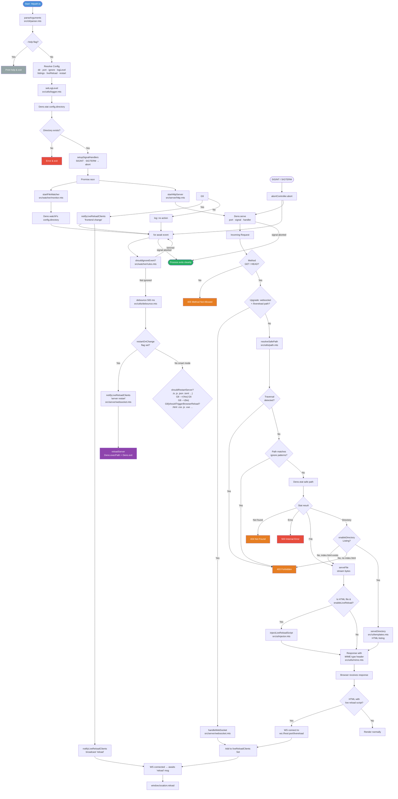
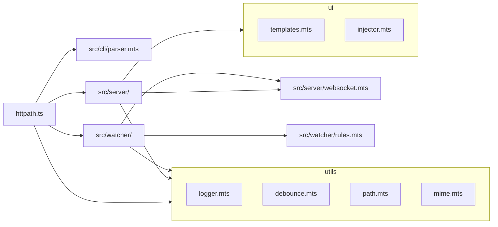
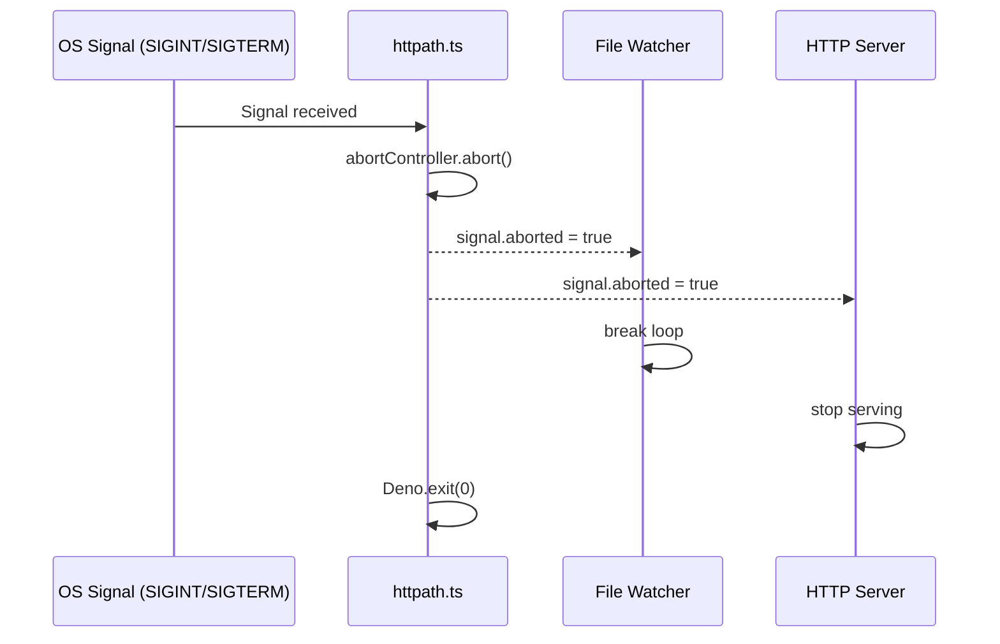
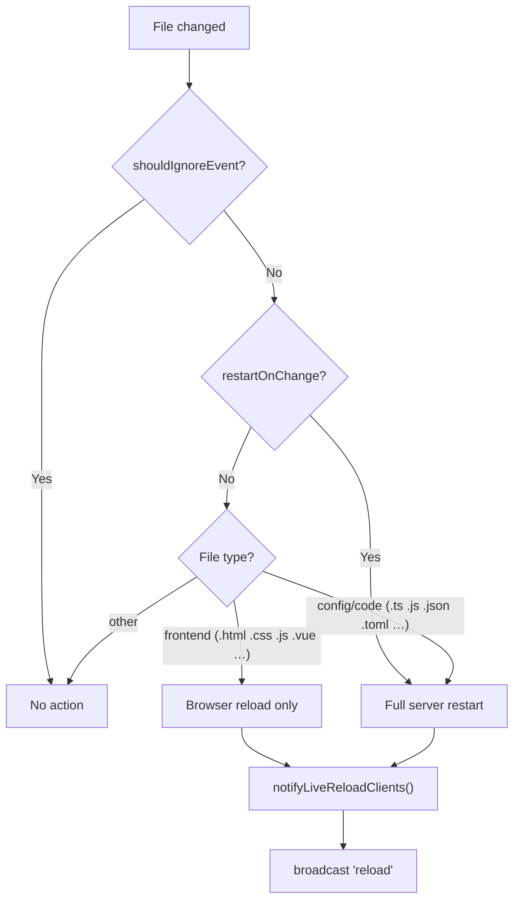
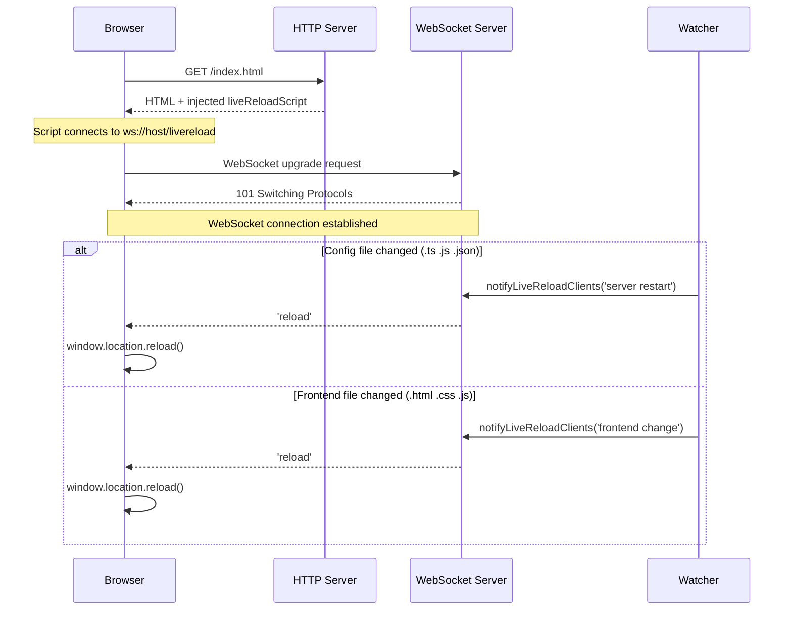
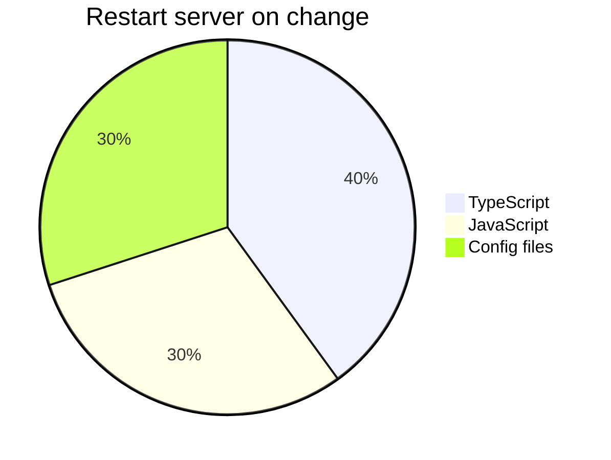

# HTTPATH CLI Workflow

## Overview

**httpath** is a Deno-based static file server with live reload capabilities, similar to `python -m http.server` but with WebSocket-powered browser auto-refresh and optional server restart-on-change. It is configured entirely via CLI flags.

## Architecture

The application consists of the following key modules:

| Module | File | Responsibility |
|--------|------|-----------------|
| Entrypoint | `httpath.ts` | Orchestration: CLI parsing, signal handling, concurrent launch |
| CLI Parser | `src/cli/parser.mts` | CLI flag parsing into typed `Config` object |
| HTTP Server | `src/server/http.mts` | Request handling, MIME types, directory listing |
| WebSocket | `src/server/websocket.mts` | Live reload WS management |
| File Watcher | `src/watcher/monitor.mts` | FS monitoring, debouncing, restart/reload decisions |
| File Rules | `src/watcher/rules.mts` | File type classification for reload strategy |
| UI Templates | `src/ui/templates.mts` | Directory listing HTML |
| Script Injector | `src/ui/injector.mts` | Live reload script injection |
| Utilities | `src/utils/` | Path safety, MIME detection, logging, debounce |

## CLI Workflow Diagram

## Module Dependency Graph

## Key Design Patterns

### AbortController Pattern

Both the HTTP server and file watcher honor the same `AbortController` signal, enabling coordinated graceful shutdown from a single source (signal handler).

### Smart Reload vs Legacy Mode

- `restartOnChange=false` (default) uses file-type classification to decide between browser refresh (frontend files) and server restart (config/code files)
- `restartOnChange=true` restarts for any file change

### WebSocket Live Reload Protocol

## CLI Flags Reference

| Flag | Alias | Type | Default |
|------|-------|------|---------|
| `--dir` | `-d` | string | `Deno.cwd()` |
| `--port` | `-p` | number | `8080` |
| `--ignore` | `-i` | string (comma-separated) | `.git,node_modules,.DS_Store` |
| `--no-listing` | — | boolean | `false` |
| `--no-live-reload` | — | boolean | `false` |
| `--restart-on-change` | `-r` | boolean | `false` |
| `--log` | — | string | `"info"` |
| `--help` | `-h` | boolean | `false` |

## File Classification Rules

### Files triggering full server restart

- `.ts`, `.js`, `.mjs`
- `.json`, `.toml`, `.yaml`, `.yml`
- `deno.json`, `deno.lock`, `package.json`

### Files triggering browser reload

- `.html`, `.htm`
- `.css`, `.scss`, `.sass`, `.less`
- `.js`, `.jsx`, `.ts`, `.tsx`
- `.vue`, `.svelte`
- `.md` (markdown)
- Images: `.png`, `.jpg`, `.jpeg`, `.gif`, `.svg`, `.webp`
- Fonts: `.woff2`, `.woff`, `.ttf`, `.eot`
